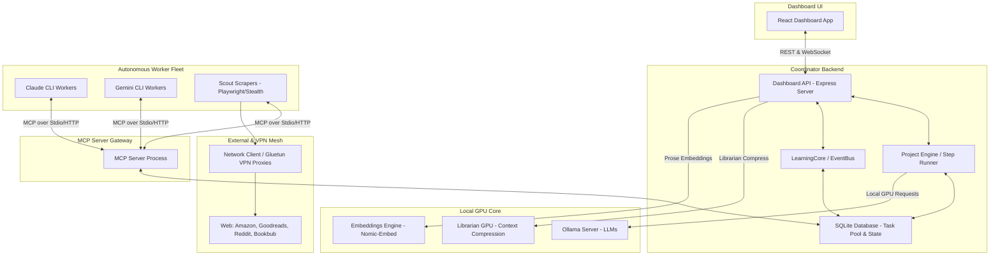
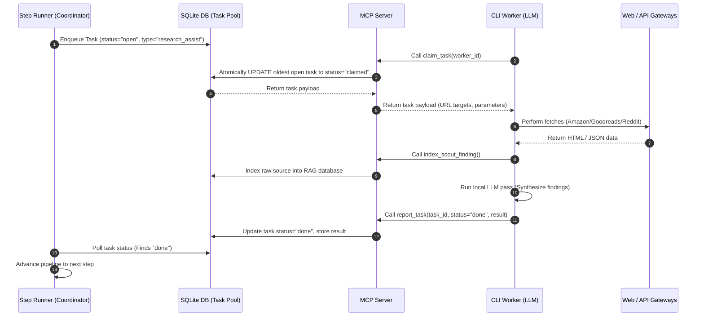
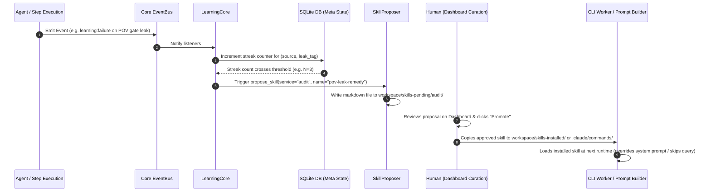
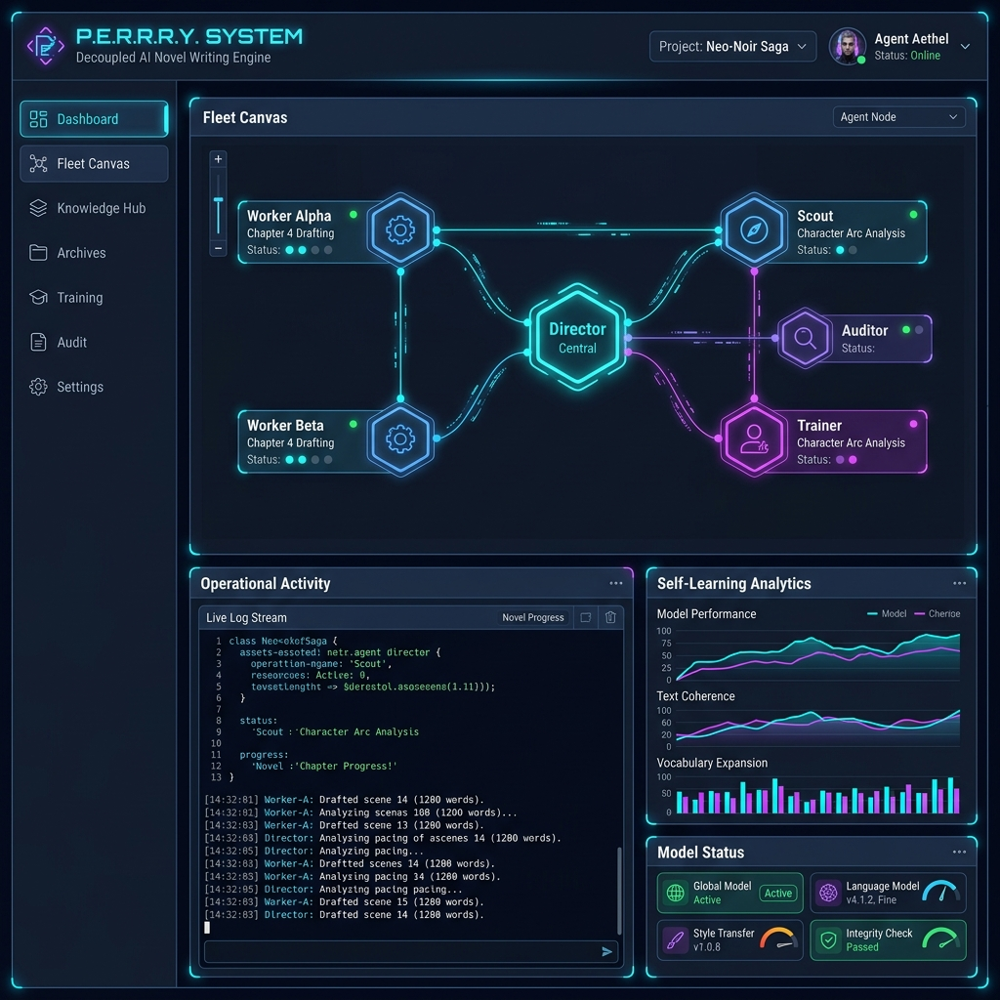
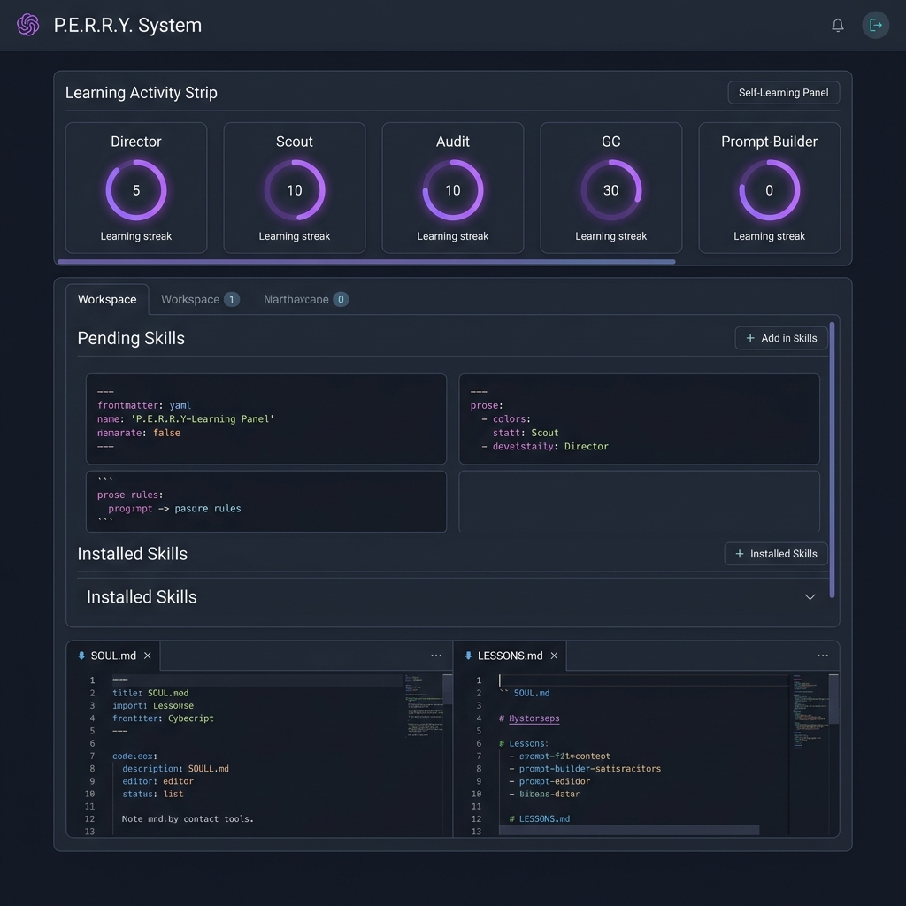

# Perry — Architecture

Perry (**P**rose, **E**valuation, **R**esearch, & **R**evision Engine) is a
self-hosted, event-driven multi-agent AI platform. The architecture is
**domain-agnostic**: a worker pool, MCP tool surface, self-learning loop, RAG
corpus, and LoRA fine-tuning pipeline that you can point at any task type for
which you have training data.

The system ships with a complete **novel-writing pipeline** as the first
end-to-end domain — multi-pen-name book projects, per-pen-name fine-tuned
models, competitive title research, audit gates, and revision. Throughout this
document, the novel-writing pipeline serves as the concrete example of how a
domain wires into the framework. The [Bring your own domain](#11-bring-your-own-domain)
section shows how to add a new one.

---

## 1. High-Level Architecture Overview

The system is organised as a monorepo containing multiple TypeScript / JavaScript
workspaces, standard configuration directories, and containerised Docker
services. It decouples the **coordinator core** from the **workers** that
execute actual LLM reasoning and external-data tasks.

### Core System Structure Diagram


---

## 2. Subsystems

### 2.1 Coordinator core ([`perry/packages/core`](../perry/packages/core) + [`perry/packages/projects`](../perry/packages/projects))

- **`ProjectEngine` / `StepRunner`** ([`step-runner.ts`](../perry/packages/projects/src/step-runner.ts)) — Coordinates the multi-step pipeline. In the novel-writing domain: Concept Keywords → Competitive Scout → Bible Planning → Scene Breakdown → Chapter Drafting → POV / Continuity Gates → Revision.
- **`StateStore`** — SQLite storage for project progress, task logs, pen-name registries, and learning meta.
- **`StyleDnaService`** — Compiles pen-specific rules (voice anchors, word filters, banned anti-patterns) and mounts them as Markdown resources injected into prompts. The pattern is reusable for any domain that wants stylistic guardrails.
- **Encrypted secrets vault** ([`secrets-service.ts`](../perry/packages/core/src/secrets-service.ts)) — AES-encrypted secret store keyed by `PERRY_VAULT_KEY`. Workers and services read decrypted secrets at runtime; the raw `.env` only needs to hold bootstrap keys.

### 2.2 Worker fleet & MCP layer ([`perry/packages/mcp-server`](../perry/packages/mcp-server) + [`perry/worker`](../perry/worker))

- **Task pool** — The engine enqueues complex, slow steps (e.g. scraping, drafting chapters) as tasks in SQLite's `task_pool` table.
- **MCP server** — Translates SQLite state into a Model Context Protocol tool surface. Workers poll via `claim_task`, complete work, and post back via `report_task`.
- **Compact schema mode** — To save tokens, the MCP server lists tool stubs in `tools/list`. Workers fetch full input schemas dynamically via `get_tool_schema` only for tools they intend to use.
- **Header-based profile filtering** — The server serves different subsets of tools based on the worker profile header (`drainer`, `researcher`, `audit`). Lets you give research workers a different surface than coordinator workers.
- **Containerised CLI workers** ([`perry/worker`](../perry/worker)) — Claude Code + Gemini CLI run inside the `perry-worker` container with host OAuth state mounted read-only. Workers spawn on demand from `WorkerCoordinator` and drain the task queue.

### 2.3 Self-learning core ([`learning-core.ts`](../perry/packages/dashboard-api/src/services/learning-core.ts))

- **Event-driven** — Listens to a small set of `learning:*` events on the EventBus. New components can opt into the learning loop by emitting these events; no per-service wiring required.
- **Recurrence detection** — Tracks `(source, kind, fingerprint)` streaks in a single `meta.learning_state` JSON blob. When a streak crosses threshold (N ≥ 3), `SkillProposer` writes a proposal to `workspace/skills-pending/{service}/`.
- **Human curation** — Approved skills go to `.claude/commands/` (consumed by CLI workers on next spawn) or `workspace/skills-installed/{service}/` (loaded at runtime by service prompt builders).
- **AgentLearningBridge** — Translates existing `agent:invocation:{started,completed,failed}` events into `learning:*` events automatically. Every registered agent gets learning for free.

### 2.4 Local-LLM stack

- **Ollama** (port `11434` internal) — Hosts general-purpose LLMs. GPU 0.
- **Ollama embeddings** (separate container) — Dedicated container for embedding + librarian models on GPU 1. Keeps a long-context compressor warm without contending with the main inference loop.
- **ComfyUI** (port `8188` host-exposed) — Image generation. Used by the novel-writing domain for book-cover generation.
- **Perry trainer** ([`perry/trainer`](../perry/trainer)) — Python container running LoRA fine-tuning on `transformers` + `peft`. Reads curated pair data from `workspace/training/{pen-slug}/` and writes back GGUF-converted models that Ollama re-tags.

### 2.5 Network / scouting mesh

- **NetworkClient** ([`network-client.ts`](../perry/packages/projects/src/services/network-client.ts)) — Single entry point for all outbound web traffic. Routes fetches through gluetun VPN proxies based on `network_path` parameter.
- **Gluetun containers** — Five VPN exits: three NordVPN WireGuard (UK / US / DE) and two TorGuard WireGuard (static dedicated IPs for Reddit / Amazon allow-listing). Each exposes an HTTP proxy on internal port `8888`.
- **perry-browser** — Headless Playwright + stealth container for anti-bot sites (Amazon, Goodreads, Bookbub). Internal-only; reached at `perry-browser:3848/fetch`.

---

## 3. Event taxonomy

The nervous system. Every learning, monitoring, and inter-service signal in
Perry flows through these events. The full canonical list lives in
[`types.ts`](../perry/packages/core/src/types.ts) — selection below.

| Event | Emitted by | Listened to by | Effect |
|---|---|---|---|
| `step:completed` | StepRunner | LearningCore, ChatMemoryService | Records step result; emits `learning:success` |
| `step:failed` | StepRunner | LearningCore, Director producer | Records failure; emits `learning:failure` after retries exhausted |
| `agent:invocation:started` | Agent runner | AgentLearningBridge | Bridge → `learning:observation` |
| `agent:invocation:completed` | Agent runner | AgentLearningBridge, ChatMemoryService | Bridge → `learning:success` |
| `agent:invocation:failed` | Agent runner | AgentLearningBridge | Bridge → `learning:failure` |
| `learning:success` | Various producers | LearningCore | Streak counter increment for `(source, kind, fingerprint)` |
| `learning:failure` | Various producers | LearningCore | Streak counter increment; cross-threshold triggers SkillProposer |
| `learning:observation` | Various producers | LearningCore | Generic recurrence counter (used by audit, GC, prompt-builder) |
| `learning:duration` | Various producers | LearningCore | Performance tracking; can trigger timeout-tightening skills |
| `worker:task:claimed` | MCP server | Dashboard live feed | Updates fleet view |
| `worker:task:reported` | MCP server | StepRunner | Wakes step poller |
| `gc:swept` | GarbageCollector | LearningCore | Emits observations on dir-growth patterns |

The pattern: services emit events, the LearningCore turns repeated patterns
into proposed skills, humans curate, and approved skills get consumed by the
service that emitted the events in the first place. Closed loop, no per-service
wiring beyond the emit and the consume.

---

## 4. Configuration model

Configuration flows through three layers, from least-trusted to most-trusted:

1. **`.env`** — Bootstrap-only. Holds `PERRY_VAULT_KEY` (the master key that unlocks everything else), `PERRY_API_KEY` (gates `/api/*`), and any external integrations that need values before the vault is unlocked (Reddit OAuth, Cloudflare tunnel token, WireGuard private keys). Gitignored.
2. **Encrypted vault** (`perry/config/.vault/vault.enc.json`) — Migrated from `.env` on first boot. After bootstrap, secrets are added/rotated through the dashboard Secrets panel; `.env` becomes optional. Gitignored.
3. **Runtime config** (`perry/config/*.json`) — Non-secret operational config (provider limits, default model picks, GC retention rules). Mix of tracked and gitignored: `default.json` + `provider_limits.json` are tracked; `user.json` is gitignored as it can contain user-specific overrides.

See [`.env.sample`](../.env.sample) for the full set of supported env-var blocks with comments on what each does.

### Subscription-only mode

A first-class architectural constraint: **Perry routes all heavy reasoning to
your Claude Pro/Max and Gemini Advanced subscriptions via the official CLIs.**
Metered API providers are blocked at the runtime level — even if you set
`OPENAI_API_KEY` or `ANTHROPIC_API_KEY` in `.env`, the agent framework refuses
to instantiate a provider that would charge per-token. This is by design: the
cost model collapses to "your subscriptions" + "your hardware electricity".

---

## 5. Security & deployment topology

### 5.1 Network exposure

| Service | Port | Exposure |
|---|---|---|
| `perry` (dashboard API) | 3847 | Host-exposed (and Cloudflare-tunnel) |
| `comfyui` | 8188 | Host-exposed (for direct ComfyUI access) |
| `ollama` | 11434 | Internal only |
| `ollama-embeddings` | 11434 | Internal only |
| `perry-browser` | 3848 | Internal only |
| `perry-worker` | 4711 | Internal only |
| `mcp-gateway` | 3851 | Internal only |
| `gluetun-*` (5 containers) | 8888 (HTTP proxy) | Internal only |

Only `perry:3847` is intended to be reachable from outside the host. The
preferred path is via **Cloudflare Tunnel** (no inbound firewall rule needed) —
the `cloudflared` container holds the tunnel connector and routes traffic into
the docker network using docker DNS.

### 5.2 Authentication

- **Dashboard auth** — `PERRY_API_KEY` Bearer token gates `/api/*`. Set once during install; rotatable via the Secrets panel.
- **MCP worker auth** — `PERRY_WORKER_SECRET` shared between coordinator and worker; gates `/spawn` calls from `WorkerCoordinator` to `perry-worker`.
- **Webhook auth** — `PERRY_WEBHOOK_SECRET` HMAC-signs inbound webhook requests at `/api/system/webhooks/*`.
- **Cloudflare Access** (optional) — `CF_ACCESS_CLIENT_ID` / `_SECRET` allow Cloudflare to require user-level access before the tunnel forwards to perry.
- **Subscription auth** — Claude Pro/Max and Gemini Advanced are authenticated through `claude login` / `gemini login` on the host. The auth dirs (`~/.claude`, `~/.gemini`) are read-only mounted into `perry-worker`.

### 5.3 Container hardening

- Every service has `mem_limit` + `pids_limit` set in `compose.yaml` — keeps a runaway one container from exhausting WSL2.
- `perry-worker` runs as the unprivileged `node` user (uid 1000 from base image).
- Auth dirs mounted read-only where possible.
- VPN containers have `cap_add: [NET_ADMIN]` and access to `/dev/net/tun` — minimum required.

---

## 6. Database schema overview

Perry stores all state in a single SQLite database at `perry/workspace/perry.db`.
Key tables:

| Table | Purpose |
|---|---|
| `task_pool` | Active worker tasks. Workers `claim_task` (atomic UPDATE) and `report_task` here |
| `task_pool_archive` | Completed / failed tasks aged out of `task_pool` (configurable retention) |
| `meta` | Key-value store. Holds `learning_state`, per-producer counters, `chat_memory_last_distilled_*` cursors, GC snapshots |
| `step_history` | Per-step audit log for each project pipeline |
| `agent_sessions` | Director and other agent run records (one per chat / invocation tree) |
| `agent_invocations` | Individual LLM calls within a session |
| `agent_trajectories` | Worker thought traces (claim → fetch → synthesize → report) |
| `project_chats` | LandingChat persistence per project |
| `pen_names` | Pen registry for the novel-writing domain |
| `rag_chunks` | RAG corpus rows. `kind` column discriminates `learning_chapter`, `learning_calibration`, `learning_cover_prompt`, `scout_finding`, `verified_scout_finding`, `chat_memory`, etc. |
| `rag_chunks_fts` | SQLite FTS5 virtual table over `rag_chunks` for BM25 search |

The RAG corpus uses a single table with a `kind` discriminator rather than per-kind tables. New domains add new `kind` values without schema migration.

---

## 7. Directory Structure

The monorepo organises logic into workspaces:

- [`perry/packages/core`](../perry/packages/core) — Base configuration, encrypted credentials vault, EventBus, logger, and core interface models.
- [`perry/packages/ai`](../perry/packages/ai) — Connectors to Ollama, ComfyUI cover generation, and text layout / rendering.
- [`perry/packages/rag`](../perry/packages/rag) — Context engine, SQLite-based BM25 / FTS5 full-text indexing, and vector similarity storage.
- [`perry/packages/projects`](../perry/packages/projects) — The pipeline engine, prompt builder, templates, step runner, and validation gates.
- [`perry/packages/dashboard-api`](../perry/packages/dashboard-api) — Express server hosting REST endpoints, RAG / session searches, and background services (Garbage Collector, LearningCore, GatewayManager).
- [`perry/packages/dashboard`](../perry/packages/dashboard) — Frontend dashboard built with React and styled with a cyberpunk aesthetic.
- [`perry/packages/mcp-server`](../perry/packages/mcp-server) — Model Context Protocol server exposing the tool surface to headless CLI workers.
- [`perry/scout`](../perry/scout) / [`perry/worker`](../perry/worker) / [`perry/trainer`](../perry/trainer) — Microservice configurations, Dockerfiles, entry scripts, and training harnesses (Python containers).

---

## 8. Core Workflows & Data Flows

### Worker Task Loop

When the system requires external processing (research, drafting, scraping),
it uses a decoupled queue workflow:



### Self-Learning Loop

The self-learning framework runs completely in the background without blocking execution:



---

## 9. UI Walkthrough

The dashboard interface follows a premium cyberpunk theme. It uses deep dark slate/navy backgrounds (`rgba(7, 9, 15, 0.85)`), vibrant neon cyan and neon purple accents (`var(--neon-cyan)` / `var(--neon-purple)`), and micro-animations to highlight statuses.

### The Fleet Canvas & Core Dashboard

The **Fleet** tab displays a visual map of all active agent nodes, current step histories, and container resource charts. It provides an immediate look at what the coordinator, scrapers, and workers are working on.



### Self-Learning & Curation Panel

The **Self-Learn** tab is divided into three key sub-tabs:
1. **Activity strip**: Displays five producer cards (Director, Scout, Audit, GC, Prompt-Builder) that track active learning observations. They pulse purple when approaching threshold limits.
2. **Pending & Installed Skills**: Lists procedural suggestions authored by workers or backend services. Operators can read the frontmatter rules, edit bodies, and approve or reject them.
3. **Pen Profiles**: Direct editor for pen-name specific `SOUL.md` (defining identity) and `LESSONS.md` (re-distilled audit rules) for the novel-writing domain.



---

## 10. Domain example: novel-writing extraction rules

The novel-writing pipeline includes domain-specific extractors that turn raw
scout data into structured planning inputs. These live in
[`step-runner.ts`](../perry/packages/projects/src/step-runner.ts) and are a
concrete example of how a domain plugs custom logic into the generic worker
task loop.

- **Reddit comment trees** — Instead of dumping raw thread listings, the runner fetches the top top-level comments by score, strips out deleted comments, and slices comments to 500 characters. Formatted into a clean markdown digest representing direct reader feedback.
- **Goodreads search** — The parser scans for Goodreads-specific schemas, pulling Title, Author, Year, Average Rating, and Rating Counts. Outputs a standardised markdown table so downstream planning steps can copy fields directly.
- **Amazon product data** — Slices product pages around `data-asin=` attributes to extract ASINs, Kindle / Paperback pricing, Best Seller Ranks (BSR), Amazon categories, and cover thumbnail URLs.
- **OpenLibrary subjects mapping** — Translates search terms into canonical OpenLibrary subject slugs (e.g. `hard_science_fiction` fallback from "orbital thriller").

A new domain would add its own extractors in the same place — anything that
takes raw worker-fetched content and turns it into structured pipeline input.

---

## 11. Bring your own domain

To point Perry at a new task type, you wire four pieces. The novel-writing
pipeline is itself an implementation of this pattern.

### 11.1 Step definitions

Add the step types to the pipeline engine in `perry/packages/projects/src/`:

```ts
// In step-runner.ts (or a domain-specific runner file)
case 'code-review:fetch-pr':
    await runFetchPrTask(step, ctx);
    break;
case 'code-review:analyze':
    await runAnalyzeTask(step, ctx);
    break;
```

Each step type is a function that takes a step row and a context, and either
completes the step inline or enqueues a worker task in `task_pool`.

### 11.2 MCP tools

Add domain-specific tools in [`perry/packages/mcp-server/src/`](../perry/packages/mcp-server/src):

```ts
// In tools/code-review.ts
export const fetchPrDiff = {
    name: 'fetch_pr_diff',
    description: 'Fetch the unified diff for a pull request',
    inputSchema: { /* ... */ },
    handler: async (input) => { /* ... */ },
};
```

Register them in the tool index. Workers see new tools automatically on next
`tools/list`; no per-worker change needed.

### 11.3 Audit gates (optional)

If your domain needs quality filtering, add a domain-specific audit service
following the pattern in [`audit-service.ts`](../perry/packages/projects/src/services/audit-service.ts).
The existing scanLeaks pattern (pen-specific anti-pattern lint) generalises to
any text quality rule set.

### 11.4 Learning events

Emit `learning:success` / `learning:failure` / `learning:observation` from your
new step handlers and audit gates. The LearningCore picks up patterns
automatically — no per-domain wiring. New skills land in
`workspace/skills-pending/{your-service}/` for human curation.

### 11.5 Optional: LoRA fine-tuning

Drop curated training pairs into `workspace/training/{your-domain}/pairs.jsonl`.
The trainer container picks them up on the next training run, fine-tunes a
LoRA adapter on top of the base model, converts to GGUF, and re-tags in Ollama.

### What you get for free

- Worker pool (Claude Code + Gemini CLI)
- Self-learning loop (skill proposal + curation + consumption)
- RAG corpus (just add new `kind` values to `rag_chunks`)
- Dashboard fleet view (any registered agent appears automatically)
- Secrets vault
- VPN-routed scouting (any traffic that needs IP rotation)
- LoRA fine-tuning pipeline
- Analytics and trajectory recording

You write the domain logic. The platform handles everything else.

---

## 12. Roadmap

Active backlog and aspirational work — including how each item plugs into the
architecture described above — lives in [`ROADMAP.md`](../ROADMAP.md). That file
is the canonical living roadmap and is updated as items ship.

---

## How to update this doc

- **Architectural change** (new subsystem, new event, new service) — update this file.
- **Feature progress** (something shipped, something started) — update `ROADMAP.md`.
- **One-off note about why a decision was made** — add an inline `<!-- comment -->` here, or a memory entry, depending on whether future readers of the repo need to see it.
