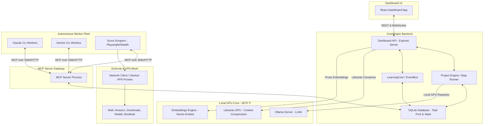
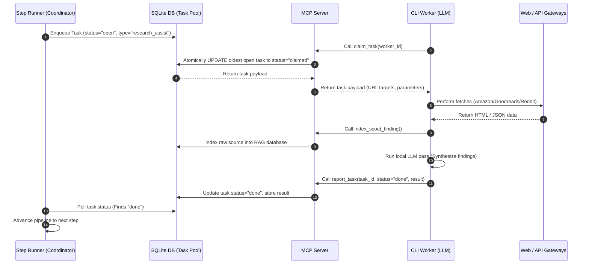
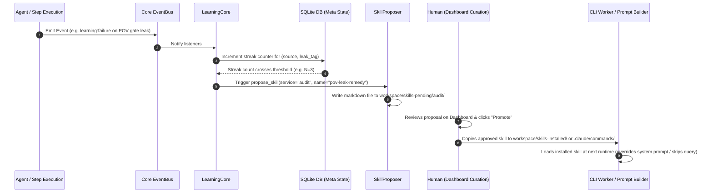

# P.E.R.R.Y. System — Architecture & Roadmap

P.E.R.R.Y. (Prose, Evaluation, Research, & Revision Engine) is a **Decoupled AI Novel Writing Engine**. It operates on a self-hosted, event-driven, micro-service architecture that enables an operator to manage automated book-writing pipelines under multiple pen names, complete with fine-tuning, competitive title research (scouting), and self-learning feedback loops.

---

## 1. High-Level Architecture Overview

The system is organized as a monorepo containing multiple TypeScript/JavaScript workspaces, standard configuration directories, and containerized Docker services. It decouples the core coordinator engine from the workers that execute actual LLM reasoning and web-scraping tasks.

### Core System Structure Diagram

### Subsystems Breakdown

1. **The Coordinator Core (`packages/core` & `packages/projects`)**
   - **`ProjectEngine` / `StepRunner`**: Coordinates the multi-step book lifecycle: Concept Keywords $\rightarrow$ Competitive Scout $\rightarrow$ Bible Planning $\rightarrow$ Scene Breakdown $\rightarrow$ Chapter Drafting $\rightarrow$ POV/Continuity Gates $\rightarrow$ Revision.
   - **`StateStore`**: Handles SQLite storage for project progress, task logs, and pen-name registries.
   - **`StyleDnaService`**: Compiles pen-specific rules (voice anchors, word filters, banned anti-patterns) and mounts them as Markdown resources.

2. **The Worker Fleet & MCP Layer (`packages/mcp-server` & `perry-worker`)**
   - **Task Pool**: The engine enqueues complex, slow steps (e.g., scraping, drafting chapters) as tasks in SQLite.
   - **MCP Server**: Translates SQLite state into a tool surface. The workers poll via `claim_task`, complete work, and post back via `report_task`.
   - **Compact Schema Mode**: To save tokens, the MCP server lists stubs first. Workers fetch full input schemas dynamically via `get_tool_schema` when they claim a task.
   - **Header-Based Profile Swapping**: The server serves different subsets of tools based on worker profiles (`drainer`, `researcher`, `audit`).

3. **Self-Learning Core (`packages/dashboard-api/services/learning-core.ts`)**
   - **Event-Driven Telemetry**: Listens to system events (`learning:success`, `learning:failure`, `learning:observation`).
   - **Skill Curation Loop**: If a failure or successful behavior repeats $N \ge 3$ times, it proposes a "Skill" (procedural instruction) stored in `workspace/skills-pending/`.
   - **Direct Curation**: Approved worker skills get written to `.claude/commands/` or `.gemini/commands/` so CLI workers automatically read them on boot. Service-side skills get loaded at runtime by prompt builders.

---

## 2. Directory Structure

The monorepo organizes logic cleanly into workspaces:

- [`packages/core`](file:///d:/n8n/perry/packages/core): Base configuration, encrypted credentials vault, EventBus, logger, and core interface models.
- [`packages/ai`](file:///d:/n8n/perry/packages/ai): Connectors to Ollama, ComfyUI cover generation, and text layout/rendering.
- [`packages/rag`](file:///d:/n8n/perry/packages/rag): Context engine, SQLite-based BM25/FTS5 full-text indexing, and vector similarity storage.
- [`packages/projects`](file:///d:/n8n/perry/packages/projects): The pipeline engine, prompt builder, templates, step runner, and validation gates.
- [`packages/dashboard-api`](file:///d:/n8n/perry/packages/dashboard-api): Express server hosting REST endpoints, RAG/session searches, and background services (Garbage Collector, LearningCore, GatewayManager).
- [`packages/dashboard`](file:///d:/n8n/perry/packages/dashboard): Frontend dashboard built with React and styled with a cyberpunk aesthetic.
- [`packages/mcp-server`](file:///d:/n8n/perry/packages/mcp-server): Model Context Protocol server exposing the tool surface to headless CLI workers.
- [`scout/` / `worker/` / `trainer/`](file:///d:/n8n/perry): Microservice configurations, Dockerfiles, entry scripts, and training harnesses (Python containers).

---

## 3. Core Workflows & Data Flows

### The Worker Task Loop
When the system requires external processing (like research or drafting), it uses a decoupled queue workflow:

### Self-Learning Loop
The self-learning framework runs completely in the background without blocking execution:

---

## 4. UI Walkthrough

The dashboard interface follows a premium cyberpunk theme. It uses deep dark slate/navy backgrounds (`rgba(7, 9, 15, 0.85)`), vibrant neon cyan and neon purple accents (`var(--neon-cyan)` / `var(--neon-purple)`), and micro-animations to highlight statuses.

### The Fleet Canvas & Core Dashboard
The **Fleet** tab displays a visual map of all active agent nodes, current step histories, and container resource charts. It provides an immediate look at what the coordinator, scrapers, and workers are working on.

### Self-Learning & Curation Panel
The **Self-Learn** tab is divided into three key sub-tabs:
1. **Activity strip**: Displays five producer cards (Director, Scout, Audit, GC, Prompt-Builder) that track active learning observations. They pulse purple when approaching threshold limits.
2. **Pending & Installed Skills**: Lists procedural suggestions authored by workers or backend services. Operators can read the frontmatter rules, edit bodies, and approve or reject them.
3. **Pen Profiles**: Direct editor for pen-name specific `SOUL.md` (defining identity) and `LESSONS.md` (re-distilled audit rules).

---

## 5. Special Extraction Rules in the Step Runner

To ensure quality prose planning, [`step-runner.ts`](file:///d:/n8n/perry/packages/projects/src/step-runner.ts) processes data fetched from external sources into a structured format:

- **Reddit Comment Trees**: Instead of dumping raw thread listings, the runner fetches the top top-level comments by score, strips out deleted comments, and slices comments to 500 characters. It formats them into a clean markdown digest representing direct reader feedback.
- **Goodreads Search**: The parser scans for Goodreads-specific schemas, pulling Title, Author, Year, Average Rating, and Rating Counts. It outputs a standardized markdown table so downstream planning steps can copy fields directly.
- **Amazon product data**: Slices product pages around `data-asin=` attributes to extract ASINs, Kindle/Paperback pricing, Best Seller Ranks (BSR), Amazon categories, and cover thumbnail URLs.
- **OpenLibrary subjects mapping**: Translates search terms into canonical OpenLibrary subject slugs (e.g., `hard_science_fiction` fallback from orbital thriller).

---

## 6. Where the P.E.R.R.Y. System Could Go (Future Roadmap)

As the system moves beyond novel writing, several scaling opportunities and feature paths are planned:

### A. Coding IDE Integration (Backlog)
- **Inline VS Code Sidecar**: Add a `code-server` container in Docker Compose, mounted directly to the Perry workspace directory.
- **IDE Nav Link**: Create a dedicated navigation tab that iframes the VS Code environment, enabling operators to write custom pipeline scripts, modify RAG templates, and curate codebase styles directly from the dashboard.

### B. Intelligent Scrape-and-Clean Corpus Pipeline
- **Dataset Scraping**: Implement a `training_corpus_scrape` task where workers fetch public domain texts, author blogs, or target novels.
- **Prose Sanitizer & Similarity Filter**:
  1. Strip boilerplate/HTML tags.
  2. Run `scanLeaks` to drop chunks containing pen-specific anti-patterns.
  3. Run embeddings over candidate chunks and calculate cosine similarity against the pen-name's voice anchor centroid.
  4. Only save chunks with similarity $> 0.75$, building a premium fine-tuning dataset at `workspace/training/pen-{slug}/scraped-clean.jsonl`.

### C. Scaled Garbage Collector (GC Expansion)
As micro-services accumulate more telemetry, the GC must be expanded to prevent storage bloat:
1. **RAG Corpus Retention**: Cap RAG text chunks per pen to the top-K by recency and quality.
2. **Orphan Sweeper**: Automatically move pending skills that have sat unreviewed for $> 14$ days to an archived directory.
3. **Scout & Media GC**: Delete Reddit/Amazon HTML dumps and temporary ComfyUI cover images older than 30 days.
4. **Pruning Database Tables**: Automatically clear completed task records, agent session traces, and old Docker volumes to maintain SSD health.

### D. Multi-Service Skill Consumers
Complete the consumer-side logic for remaining services so promoted skills are dynamically applied:
- **Director**: Apply skills containing `applies_when: { task_type, error_fingerprint }` to adjust retry backoffs and timeouts automatically.
- **Auditor**: Run pre-screen short-circuits on matched rules before executing CPU-heavy regex passes.
- **GC**: Override default directory TTLs based on size-growth triggers.

### E. Gateway Extensions & Cron-Driven Writes
- **Messaging Gateways**: Productionize the existing Telegram/Discord gateways to support text triggers, mobile progress tracking, and voice instructions.
- **Scheduled Writing**: Enable cron triggers to schedule automated writing runs (e.g., *"Write next scene at 9:00 AM and deliver output to Discord"*).
